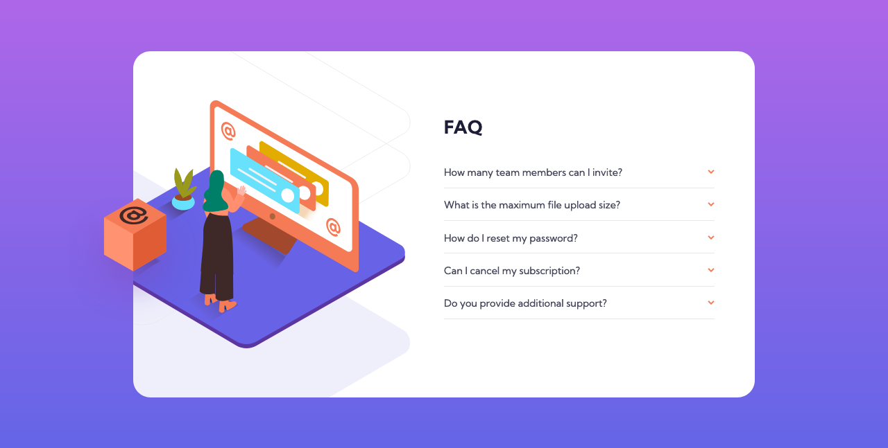

# Frontend Mentor - FAQ accordion card solution

This is a solution to the [FAQ accordion card challenge on Frontend Mentor](https://www.frontendmentor.io/challenges/faq-accordion-card-XlyjD0Oam). Frontend Mentor challenges help you improve your coding skills by building realistic projects. 

## Table of contents

- [Overview](#overview)
  - [The challenge](#the-challenge)
  - [Screenshot](#screenshot)
  - [Links](#links)
- [My process](#my-process)
  - [Built with](#built-with)
  - [Useful resources](#useful-resources)
- [Author](#author)

## Overview

### The challenge

Users should be able to:

- View the optimal layout for the component depending on their device's screen size
- See hover states for all interactive elements on the page
- Hide/Show the answer to a question when the question is clicked

### Screenshot

### Links

- Solution URL: [Github](https://github.com/flp-pcll/faq-accordion-card)
- Live Site URL: [Github Pages](https://flp-pcll.github.io/faq-accordion-card/)

## My process

### Built with

- Semantic HTML5 markup
- SCSS
- Flexbox
- Javascript

### Useful resources

- [The hover media feature](https://developer.mozilla.org/en-US/docs/Web/CSS/@media/hover)
- [HTML vs Body: How to Set Width and Height for Full Page Size](https://www.freecodecamp.org/news/html-page-width-height/)
- [The Element.closest() Method](https://developer.mozilla.org/pt-BR/docs/Web/API/Element/closest)

## Author

- Website - [Felipe Pacelli](https://github.com/flp-pcll)
- Frontend Mentor - [@flp-pcll](https://www.frontendmentor.io/profile/flp-pcll)

